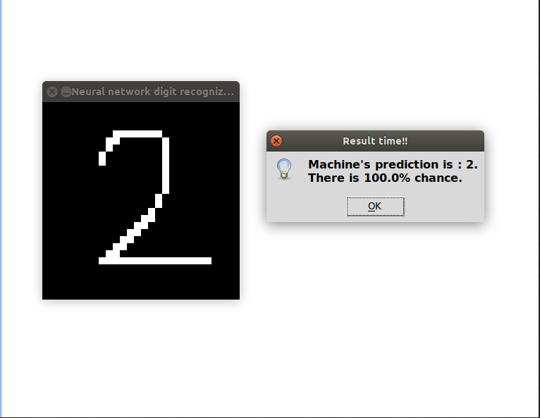
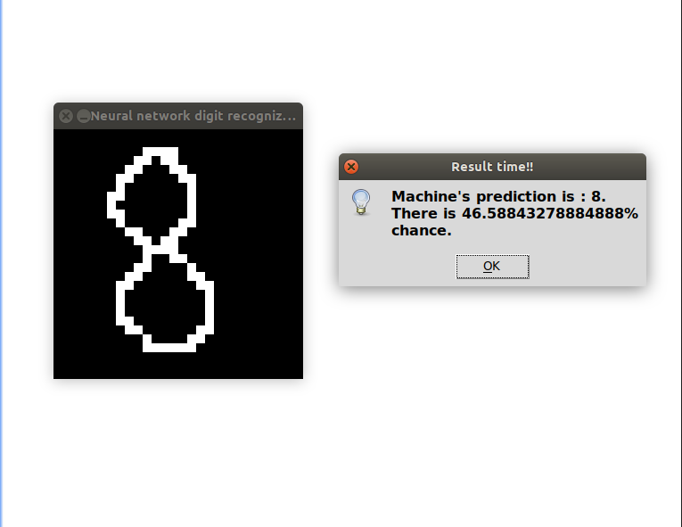

# Offline Digit Recognization Application

A complete offline application built using python libraries that uses neural network in order to predict the digit drawn over screen.

# Modules

1.  Tensorflow for neural.
2.  Pygame for drawing digit.
3.  Tkinter for displaying results.
4.  Numpy.

# Screenshots
  
  
  
  
   
  
# Steps

  1. User simply draws a digit over the screen using mouse.

  2. Then presses [SPACE] or [ENTER] in order to get the results.
  
        > (Machine runs algos here.. and predicts the result)
  
  3. To clear the screen press right-mouse button.
